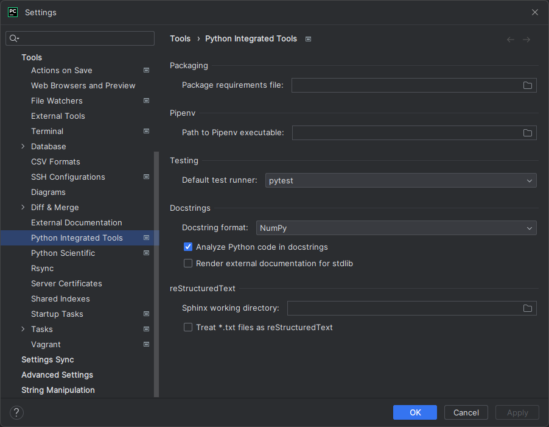

# Environment

This document describes how to configure and use your development environment.

## Prerequisites

You must complete these steps once before you can start setting up the project itself:

1. Install [Python 3.10](https://www.python.org/downloads/).
2. Verify that `python` can be launched by running this command in a **new** terminal:
    ```shell
    python --version
    ```
    If this fails, add the directory that contains the `python` executable to your `PATH` environment variable.

3. Install [Poetry](https://python-poetry.org/docs/master/#installing-with-the-official-installer) with the official installer. Follow the instructions for your operating system in the linked document.
4. Verify that `poetry` can be launched by running this command in a **new** terminal:
    ```shell
    poetry --version
    ```
    If this fails, add the directory that contains the `poetry` executable to your `PATH` environment variable.

## Project setup

Follow the instructions for your preferred IDE. If you want to use neither [PyCharm](https://www.jetbrains.com/pycharm/) nor [Visual Studio Code](https://code.visualstudio.com/), use the generic instructions. You only need to do these steps once.

!!! note

    All terminal commands listed in this section are assumed to be run from the root of the repository.

=== "PyCharm"

    1. Clone the repository.
    2. Open the project folder in PyCharm.
    3. Follow the instructions in the [PyCharm documentation](https://www.jetbrains.com/help/pycharm/poetry.html#poetry-env) to create a **new** Poetry environment and to install the dependencies of the project.
    4. Open the PyCharm settings and search for "Python Integrated Tools". Set the "Default test runner" to "pytest" and the "Docstring format" to "NumPy". Your settings should look like this:
        

=== "Visual Studio Code"

    1. Clone the repository.
    2. Open the project folder in Visual Studio Code.
    3. Install the [Python extension](https://marketplace.visualstudio.com/items?itemName=ms-python.python).
    4. Create a new Poetry environment and install the dependencies of the project by running this command:
        ```shell
        poetry install
        ```
    5. Find the path to the Poetry environment that was created in step 4 by running this command:
        ```shell
        poetry env info --path
        ```
    6. Copy the output of step 5 to your clipboard.
    7. Open the command palette and search for "Python: Select Interpreter".
    8. Select the Poetry environment that matches the output of step 5. It should show up in the list of available interpreters. If it does not, you can pick it manually by choosing "Enter interpreter path..." and pasting the path that you copied in step 6 into the input field.
    9. Open the command palette and search for "Python: Configure Tests".
    10. Select "pytest" as the test runner.
    11. Select "tests" as the directory containing tests.

=== "Generic"

    1. Clone the repository.
    2. Create a new Poetry environment and install the dependencies of the project by running this command:
        ```shell
        poetry install
        ```

## Running the tests

=== "PyCharm"

    Right-click the `tests` directory in the [Project tool window](https://www.jetbrains.com/help/pycharm/project-tool-window.html) and select "Run 'pytest in tests'".

=== "Visual Studio Code"

    Run the tests by opening the command palette and searching for "Test: Run All Tests".

=== "Generic"

    Run this command from the root of the repository:
        ```shell
        poetry run pytest
        ```

## Serving the documentation

1. Start the server by running this command from the root of the repository:
    ```shell
    poetry run mkdocs serve
    ```
2. Check the command output for the URL of the created site and open it in a browser (usually [localhost:8000](http://localhost:8000)).

You can keep the server running while you edit the documentation. The server will automatically rebuild and reload the site when you save changes.
